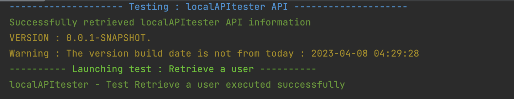

# CaptainApi

## What is Captain API ?

Captain API is a small API tester which allows you to test if your API has been well deployed on you distant server.
It supports oAuth2 authentication using Client ID/Secret.
All the needed datas concerning your API must be filled inside the environment.json file
You can test this project by launching the following API locally : https://github.com/LewandowskiAnthony/publicTestingAPI

## How to start ?

### Install python3

First of all, the most important thing is to install you python environment on your engine.
This project has been made using Python 3, so we recommend you to install the latest Python 3 version :
https://www.python.org/downloads/

### Install needed package

```
python3 -m pip install colorama requests datetime
```

### Fill the json environment file

#### Fields

The json environment file contain 3 different types of information :

| Name             | Purpose                                                                                                                    | Example                                                                                                  |
|------------------|----------------------------------------------------------------------------------------------------------------------------|----------------------------------------------------------------------------------------------------------|
| running_variable | All the variables that can affect the output display and behavior                                                          | The debug_mode variable allows you to enter in debug mode and shows you what is going on behind the code |
| authentication   | All the informations you'll need to authenticate to your API using oAuth2 authentication                                   | the client_id                                                                                            |
| apis             | This field in an array containing all your APIs informations. Captain API will check test every API mentioned in this part | url which is the URL of your API without the versioning                                                  |

#### Authentication Definition example

There's currently only two type of authentication supported by Captain API : oAuth2 with Client Grant Type and No auth. </br>
No auth will be defined has shown below : 
```
  "authentication": {},
```
oAuth2 with Client grantType will be defined has shown below : 
```
  "authentication": {
    "type" : "oAuth2",
    "grantType": "Client",
    "credential_name" : "My credential name to know who's the user",
    "clientId": "XxXXxxxXX0000xxXXXXX00000000xxxxXXXxxxX00",
    "client_secret": "XxXXxxxXX0000xxXXXXX00000000xxxxXXXxxxX00XXXXXXXXxxxxxXXxXXXXXXXX000",
    "oAuth2Url": "https://my-auth-url.com/token",
    "comment": "Here is a comment to make it more clear about where my token come from"
  }
```

#### Api Definition example

Here's an example to completion for an API test, admitting you want to test an api which follows this url : <br>
http://my-super-api/api/v1/clients/1000
Admitting this is the endpoint to test you'll have to fill the environment.json as :

```
"apis": [
    {
      "url": "http:/my-super-api/",
      "x-api-key": "YOUR_API_KEY",
      "x-env": "YOU X-ENV", 
      "tests" : [
        {
          "test_name" : "This test does this action",
          "test_endpoint": "api/v1/clients/",
          "test_value" : 1,
          "http_method" : "GET",
          "field_to_check": "id"
        }
      ],
      "api_name": "My Super Api"
    }
]
```

| Attribute         | Definition                                                                                                | Facultative ? | Example               |
|-------------------|-----------------------------------------------------------------------------------------------------------|---------------|-----------------------|
| url               | Url of the API without endpoint. (Root of the /actuator/health endpoint)                                  | FALSE         | http:/my-super-api/   |
| x-api-key         | Api Key of your API                                                                                       | FALSE         | xxxxx-xxxxxxxx-xxxxxx |
| x-env             | API env to test                                                                                           | TRUE          | PREPROD               |
| x-api-key         | Api Key of your API                                                                                       | FALSE         | xxxxx-xxxxxxxx-xxxxxx |
| tests             | Array of tests to execute                                                                                 | TRUE          | {ARRAY OF OBJECTS}    |
| skip_health_check | Skip the call to /actuator/health and /actuator/info, useful if you use an API that doesn't use standards | TRUE          | {ARRAY OF OBJECTS}    |
| test_name         | Name of a test and what it does                                                                           | TRUE          | Retrieve a client     |
| test_endpoint     | Endpoint to test (Starting after your API url)                                                            | TRUE          | /api/v1/client/       |
| test_value        | Value to test (Like client ID)                                                                            | TRUE          | 1                     |
| http_method       | Method of the test                                                                                        | TRUE          | GET                   |
| field_to_check    | Fields in the return body to check if exists                                                              | TRUE          | id                    |      
| api_name          | Name of the API to display                                                                                | FALSE         | My Awesome API        |           

### Start the project

You can start the script using your command line :

```
python3 main.py environment.json
```



Congratulation, you API is up !
